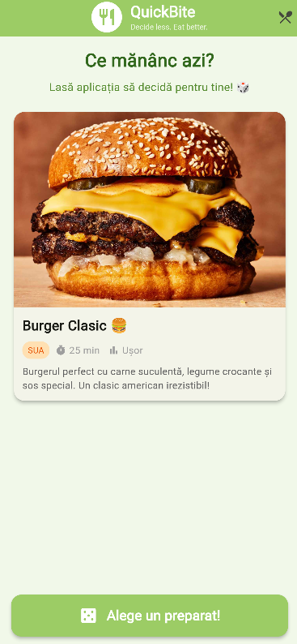
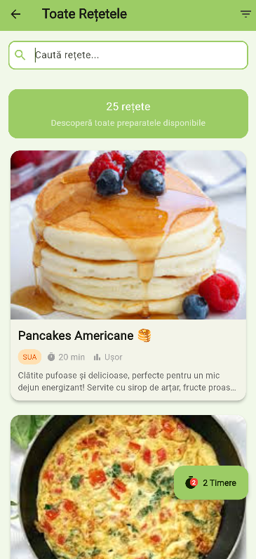

<div align="center">

# 🍕 **QuickBite - Your Daily Food Decision Maker** 

[](https://flutter.dev)
[](https://dart.dev)
[](LICENSE)

</div>

**QuickBite** este asistentul tău culinar care te ajută să iei cea mai importantă decizie a zilei: **Ce să mănânci azi?** 

Aplicația oferă o colecție de rețete delicioase, sistem de alegere aleatoare, **timere multiple simultane cu persistență**, **notificări avansate** și **overlay global** pentru urmărirea timpilor de gătit în timp real - totul într-o interfață modernă și elegantă!

---

## 📸 Screenshots

<p align="center">
  
  
  
</p>

---

## ✨ Caracteristici Principale

### 🎯 Funcționalități Core
- 🎲 **Alegere Aleatoare**: Lasă aplicația să decidă pentru tine cu un simplu tap
- 📖 **Colecție Extinsă**: 20+ rețete diverse (mic dejun, prânz, cină, deserturi)
- 🔍 **Filtre Avansate**: 
  - Filtrare după tip masă (Mic Dejun, Prânz, Cină, Desert)
  - Filtrare după țară/origine (Italia, SUA, Japonia, etc.)
  - Filtrare pentru vegetarieni
- 👨‍🍳 **Pași de Preparare**: Ghid pas cu pas pentru fiecare rețetă
- 📋 **Detalii Complete**: Ingrediente, timp de preparare, nivel de dificultate

### ⏰ Sistem Avansat de Timere (NEW!)
- **Timere Multiple Simultane**: Pornește câte timere vrei pentru pași diferiți din rețete diferite
- **Persistență Globală**: Timerele continuă să ruleze chiar când navighezi între ecrane
- **Overlay Flotant**: Badge vizibil pe toate ecranele care afișează numărul de timere active
- **Bottom Sheet Detaliat**: Vezi toate timerele active grupate pe rețete cu un singur tap
- **Navigare Rapidă**: Click pe orice timer din overlay pentru a sări direct la pasul respectiv
- **Feedback Haptic Triplu**: 3 vibrații puternice când timer-ul se termină
- **Notificări Rich**: Notificări Android cu vibrații personalizate [500ms-200ms-500ms-200ms-500ms]
- **Afișare pe Lock Screen**: Notificările apar chiar și când telefonul e blocat

### 🎨 Design & UX
- 🌟 **Material Design 3**: Interfață modernă și elegantă
- 🌐 **Imagini de Calitate**: Suport pentru imagini locale și externe
- ⚡ **Performanță**: Animații fluide (Hero animations) și experiență rapidă
- 🔒 **SafeArea**: Layout adaptat pentru butoanele de navigare ale telefonului

---

## 🏗️ Arhitectură și Clean Code

Aplicația este construită cu **Flutter** și respectă principiile **Clean Code**:

```
lib/
├── common/              # Constante și configurații globale
│   ├── app_strings.dart # Toate textele UI (fără hardcoding)
│   └── app_theme.dart   # Tema aplicației (culori, stiluri)
├── data/                # Date statice
│   └── food_data.dart   # Lista cu preparate (20+ rețete)
├── models/              # Modele de date
│   └── food_item.dart   # Model pentru preparat + pași de gătit
├── screens/             # Ecranele aplicației
│   ├── home_screen.dart           # Ecran principal cu alegere aleatorie
│   ├── all_foods_screen.dart      # Listă rețete + filtre
│   ├── food_details_screen.dart   # Detalii rețetă
│   └── cooking_steps_screen.dart  # Pași preparare + timer
├── utils/               # Servicii și funcții helper
│   ├── timer_service.dart         # ⭐ Singleton pentru timere globale
│   ├── notification_service.dart  # ⭐ Serviciu notificări Android
│   ├── navigation_helper.dart
│   └── dialog_helper.dart
├── widgets/             # Componente reutilizabile
│   ├── active_timers_overlay.dart # ⭐ Overlay flotant cu timere active
│   ├── cooking_timer_widget.dart  # ⭐ Widget timer cu control play/pause
│   ├── background_timer_indicator.dart # ⭐ Indicator vizual pentru timere active
│   ├── step_content_card.dart     # Card pentru conținutul pasului
│   ├── step_navigation_buttons.dart # Butoane navigare între pași
│   ├── food_card.dart
│   ├── food_info_badges.dart
│   ├── food_prep_time.dart
│   ├── food_description.dart
│   ├── food_ingredients_list.dart
│   └── food_action_button.dart
└── main.dart            # Entry point
```

### 🎯 Principii de Design

- **Separarea Responsabilităților**: Fiecare modul are un scop bine definit
- **Widget-uri ca Clase**: Toate widget-urile custom sunt clase (nu funcții) pentru performanță optimă
- **Singleton Pattern**: `TimerService` și `NotificationService` - instanță globală unică
- **Stream-Based Architecture**: `StreamController.broadcast()` pentru comunicare între ecrane
- **Constante Centralizate**: Tot textul UI este în `app_strings.dart`, tema în `app_theme.dart`
- **Reutilizare**: Componente modulare și ușor de întreținut
- **Fără Hardcoding**: Texte, culori și configurații sunt în fișiere dedicate

### 🔧 Arhitectura Sistemului de Timere

```
┌─────────────────────────────────────────────────────┐
│                 TimerService (Singleton)            │
│  - Map<String, ActiveTimer> _activeTimers          │
│  - StreamController.broadcast() pentru UI updates  │
│  - Persistă între ecrane                            │
└──────────────────┬──────────────────────────────────┘
                   │
         ┌─────────┴─────────┐
         ▼                   ▼
┌──────────────────┐  ┌──────────────────┐
│  CookingTimer    │  │ ActiveTimers     │
│  Widget          │  │ Overlay          │
│  - Start/Stop    │  │ - Badge count    │
│  - Display time  │  │ - Bottom sheet   │
│  - Haptic        │  │ - Navigation     │
└────────┬─────────┘  └────────┬─────────┘
         │                     │
         └──────────┬──────────┘
                    ▼
         ┌─────────────────────┐
         │ Notification Service │
         │ - Android native     │
         │ - Vibration pattern  │
         │ - Lock screen        │
         └─────────────────────┘
```

---

## 🍽️ Meniul QuickBite

Aplicația vine cu **20+ preparate internaționale** organizate pe categorii:

### 🌅 Mic Dejun
- Pancakes Americane
- Omletă cu Legume
- Smoothie Bowl Tropical
- Croissant Franceză

### 🍽️ Prânz
- Pizza Margherita (Italia)
- Burger Clasic (SUA)
- Paste Carbonara (Italia)
- Sushi Roll (Japonia)
- Salată Caesar
- Falafel (Vegetarian)
- Quiche Lorraine

### 🌙 Cină
- Tacos Mexicani
- Shawarma
- Ramen Japonez
- Pad Thai (Thailanda)
- Ciorbă de Burtă (România)
- Sarmale (România)
- Paella Valenciana (Spania)
- Curry Indian

### 🍰 Deserturi
- Tiramisu (Italia)
- Cheesecake New York
- Lava Cake Ciocolată
- Brownie Ciocolată

**Filtrare disponibilă:** Tip masă, Țară, Vegetarian/Non-vegetarian

---

## 🚀 Instalare și Rulare

### Cerințe

- Flutter SDK (3.10.0 sau mai nou)
- Dart SDK (3.10+)
- Android Studio / VS Code cu extensia Flutter
- Un emulator Android (API 21+) sau dispozitiv fizic
- Java JDK 17+ (pentru build Android)

### Pași

1. **Clonează repository-ul**:
   ```bash
   git clone https://github.com/[username]/quickbite.git
   cd quickbite
   ```

2. **Verifică mediul Flutter**:
   ```bash
   flutter doctor
   ```

3. **Instalează dependențele**:
   ```bash
   flutter pub get
   ```

4. **Rulează aplicația**:
   ```bash
   # Pe dispozitiv conectat
   flutter run
   
   # Pe emulator specific
   flutter devices  # Vezi dispozitivele disponibile
   flutter run -d <device_id>
   ```

5. **Build pentru release**:
   ```bash
   # APK
   flutter build apk --release
   
   # App Bundle (pentru Google Play)
   flutter build appbundle --release
   ```

### ⚠️ Note Importante

- **Permisiuni**: La prima rulare pe Android 13+, aplicația va solicita permisiune pentru notificări
- **Timere**: Timerele persistă între ecrane dar se resetează la închiderea aplicației
- **Testare**: Pentru testarea notificărilor, folosește un dispozitiv fizic (emulator-ul poate avea limitări)

---

## 📦 Dependențe

Aplicația folosește dependențe moderne pentru funcționalități avansate:

```yaml
dependencies:
  flutter:
    sdk: flutter
  cupertino_icons: ^1.0.8
  
  # Sistem avansat de notificări
  flutter_local_notifications: ^18.0.1  # Notificări locale Android/iOS
  permission_handler: ^11.3.1           # Gestionare permisiuni runtime

dev_dependencies:
  flutter_test:
    sdk: flutter
  flutter_launcher_icons: ^0.14.1       # Generare automată iconiță
```

### 📱 Configurări Android

- **Target SDK**: Android 34 (API Level 34)
- **Min SDK**: Android 21 (API Level 21) - suport pentru 95%+ dispozitive
- **Compilesdk**: 34
- **Core Library Desugaring**: Activat pentru compatibilitate Java 8+ features
- **Permissions**: 
  - `POST_NOTIFICATIONS` - notificări (Android 13+)
  - `VIBRATE` - feedback haptic
  - `USE_FULL_SCREEN_INTENT` - notificări pe lock screen

---

## 🛠️ Tehnologii Folosite

- **Flutter** - Framework UI cross-platform
- **Dart** - Limbaj de programare
- **Material Design 3** - Design system modern
- **Hero Animations** - Tranziții fluide între ecrane
- **StatefulWidget** - State management simplu și eficient
- **Streams & StreamController** - Reactive programming pentru timere
- **Singleton Pattern** - Servicii globale persistente
- **Flutter Local Notifications** - Sistem notificări nativ
- **Android Notification Channels** - Canale dedicate pentru timere
- **Haptic Feedback** - Vibrații tactile (HeavyImpact x3)
- **SafeArea** - Layout adaptive pentru gesture navigation

---

## 📱 Platforme Suportate

- ✅ **Android** (Primary Target)
  - Interfață adaptivă pentru telefoane și tablete
  - Notificări native cu canale dedicate
  - Gesture navigation support (SafeArea)
  - Testat pe Samsung S24 Ultra (Android 16)
  
- ⚠️ **iOS** - Partial Support
  - UI complet funcțional
  - Notificări locale cu limitări iOS
  - Necesită configurare suplimentară pentru permissions

- 🔧 **Web & Desktop** - Limited
  - UI responsive funcțional
  - Notificări și vibrații nu sunt disponibile

---

## 🎮 Cum Funcționează Timerele

### Fluxul de Utilizare

1. **Pornire Timer**
   - Navighează la o rețetă → "Începe Gătitul"
   - Selectează un pas cu timp de preparare
   - Apasă butonul ▶️ pentru a porni timer-ul

2. **Timere Multiple**
   - Poți porni timere pentru mai mulți pași simultan
   - Fiecare timer rulează independent
   - Overlay-ul flotant afișează numărul total de timere active

3. **Monitorizare Cross-Screen**
   - Badge-ul orange apare în colțul din dreapta jos
   - Apasă pe badge pentru a vedea toate timerele
   - Bottom sheet-ul grupează timerele pe rețete

4. **Navigare Rapidă**
   - Click pe orice timer din listă
   - Ești dus automat la pasul respectiv din rețetă
   - Timer-ul continuă să ruleze

5. **Notificări**
   - Când timer-ul ajunge la 0:00:
     - 3 vibrații puternice (haptic feedback)
     - Notificare Android cu pattern custom de vibrații
     - Mesaj: "⏰ Timer Terminat! Pasul X din [Rețetă] este gata"

### 🧪 Caracteristici Tehnice

- **Key Format**: `"foodName_stepIndex"` pentru identificare unică
- **Stream Updates**: UI-ul se actualizează automat folosind `StreamBuilder`
- **Memory Efficient**: Timer-ele inactive sunt șterse automat din memorie
- **Thread-Safe**: Singleton pattern previne race conditions
- **Vibration Pattern**: `[0ms, 500ms, 200ms, 500ms, 200ms, 500ms]`

---

## 🎯 Cazuri de Utilizare

### Scenariul 1: Gătit Complex Multi-Pas
```
1. Pornești pasta la fiert (12 min timer)
2. În paralel, pornești sosul la gătit (8 min timer)
3. Vezi overlay-ul: "2 timere active"
4. Navighezi la desert pentru a verifica rețeta
5. Ambele timere continuă să ruleze
6. Primești notificare când sosul e gata
7. Click pe notificare → revii la pas
```

### Scenariul 2: Preparare Multiplă
```
1. Faci pizza (30 min la cuptor)
2. În același timp, faci tiramisu (2 ore la frigider)
3. Badge-ul arată "2 timere"
4. Click pe badge → vezi ambele timere
5. Click pe "Pizza" → sari direct la pasul coacerii
```

---

**Poftă bună! 🍽️**
