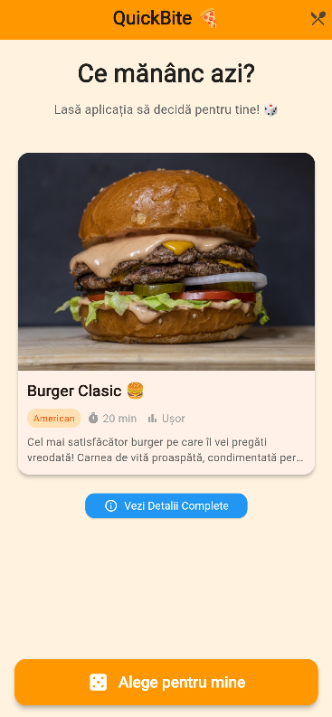
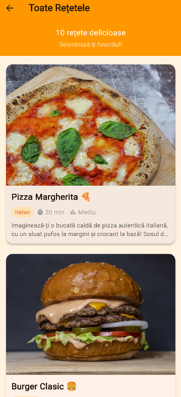

🍕 QuickBite — Decizii Rapide, Gusturi Memorabile

QuickBite transformă dilema zilnică „Eu ce mănânc azi?” într-o experiență distractivă și interactivă. Dezvoltată în Flutter, aplicația combină un design vibrant cu o funcționalitate intuitivă pentru a-ți oferi sugestia culinară perfectă în câteva secunde.

✨ Experiența Utilizatorului

Aplicația este construită în jurul a trei piloni fundamentali: Simplitate, Estetică și Eficiență.

🎲 Alege pentru mine: Un motor de selecție aleatorie cu animații fluide care elimină oboseala decizională.
📖 Catalog Gastronomic: Explorează o listă curatoriată de 10 preparate internaționale, de la Sushi la Tacos.
🔍 Detalii Imersive: Fiecare rețetă include descrieri bogate, liste de ingrediente, timpi de preparare și niveluri de dificultate.
🎨 Design Modern: Interfață bazată pe Material Design 3, cu o paletă caldă de culori (Orange & Amber) care stimulează apetitul.
🏗️ Arhitectura Proiectului

Codul este organizat modular pentru a respecta bunele practici de dezvoltare și pentru a asigura o mentenabilitate ridicată:

lib/
├── 📱 main.dart            # Punctul de lansare & Tema aplicației
├── 📦 models/              # Structuri de date (FoodItem)
├── 💾 data/                # Sursa de date hardcodate
├── 🧩 widgets/             # Componente UI reutilizabile (Card-uri, Badges, Butoane)
└── 🖼️ screens/             # Ecranele principale (Home, List, Details)

🛠️ Detalii Tehnice de Implementare

Caracteristică	Tehnologie / Widget Utilizat

State Management	StatefulWidget cu setState pentru animații și selecție
Navigare	        Navigator.push cu tranziții native
Layout	            CustomScrollView & Slivers pentru efecte de scroll premium
Responsiveness	    ConstrainedBox (max 800px) pentru experiență optimă pe Web/Desktop
Animații	        AnimationController & ScaleTransition pe butonul principal
UI Kit	            Material Design 3, ClipRRect pentru imagini, GoogleFonts

🍽️ Meniul QuickBite

Aplicația vine pre-configurată cu 10 delicii globale:

1. Pizza Margherita 🇮🇹 
2. Burger Clasic 🇺🇸 
3. Sushi Roll 🇯🇵 
4. Tacos Mexicani 🇲🇽 
5. Paste Carbonara 🇮🇹 
6. Salată Caesar 🥗 
7. Ramen Japonez 🍜 
8. Shawarma 🥙 
9. Pancakes 🥞 
10. Pad Thai 🇹🇭

🚀 Instalare și Rulare

Pentru a porni aplicația în mediul de dezvoltare, urmează pașii:

1. Clonează repository-ul
2. Verifică integritatea mediului:

flutter doctor

3. Instalează dependențele:

flutter pub get

4. Lansează în simulator/browser:

flutter run

📱 Platforme Suportate

Mobile: iOS & Android (Interfață adaptivă)
Web: Optimizat pentru Chrome/Safari/Edge
Desktop: Windows & macOS (Layout centrat pentru lizibilitate)

## 📸 Capturi de Ecran

Sistemul vizual folosește un fundal cald Orange[50] și carduri elevate pentru un contrast modern.

<table>
  <tr>
    <td align="center"><b>Ecran Principal</b></td>
    <td align="center"><b>Listă Preparate</b></td>
    <td align="center"><b>Detalii Rețetă</b></td>
  </tr>
  <tr>
    <td></td>
    <td></td>
    <td></td>
  </tr>
  <tr>
    <td align="center"><i>Interfață Minimalistă</i></td>
    <td align="center"><i>Scroll Infinit</i></td>
    <td align="center"><i>Informații Complete</i></td>
  </tr>
</table>
